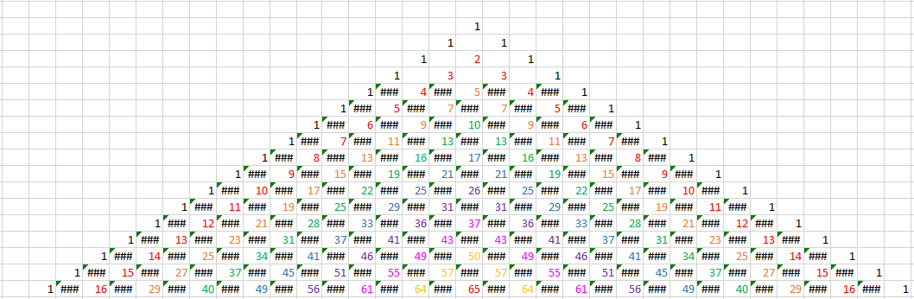

## RascalsTriangle

A project assigned by [Professor Andrew Schwimmer](https://github.com/andrewoid ""). 

#### The Task
The task was to design a non-recursive function to find the mth number
in the nth row of Rascal's Triangle. Look at below visual to see color coded visual of Rascal Triangle diagonal patterns.

See this for original contest question.

See [this](https://www.maa.org/sites/default/files/Anggoro2010.pdf "") brief explanation of the difference between Pascal's
Triangle and Rascal's Triangle as well as the derivation of the formula to 
find the mth number in the nth row of the Rascal Triangle. 